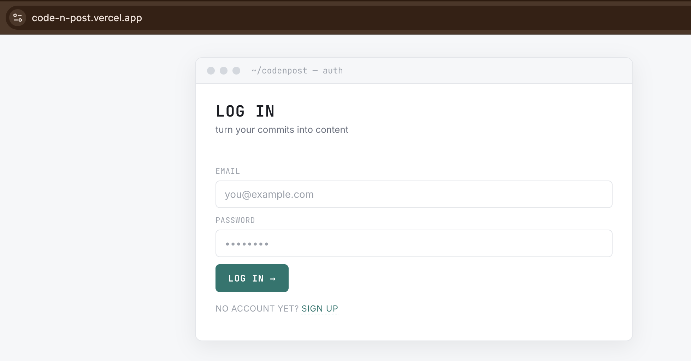
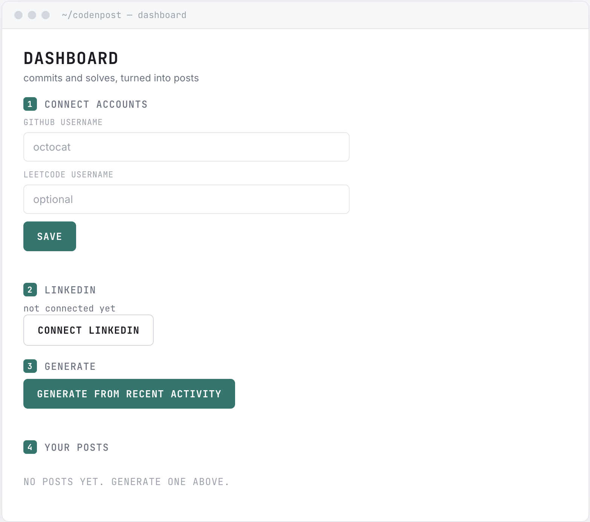
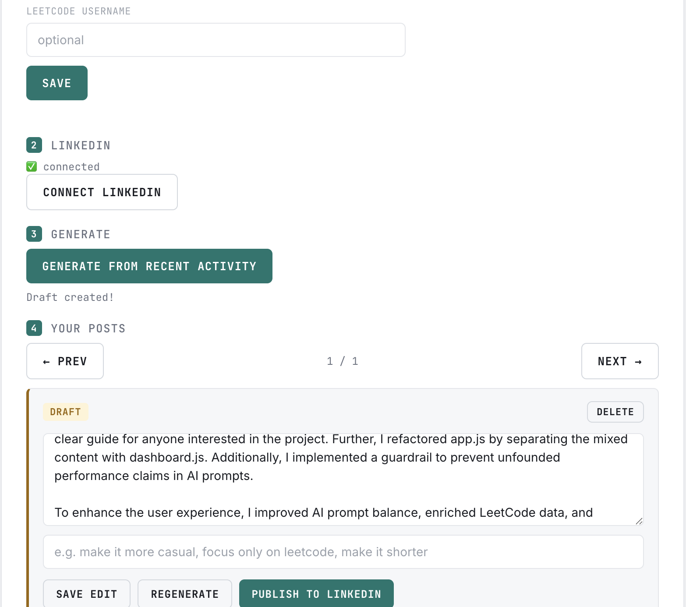
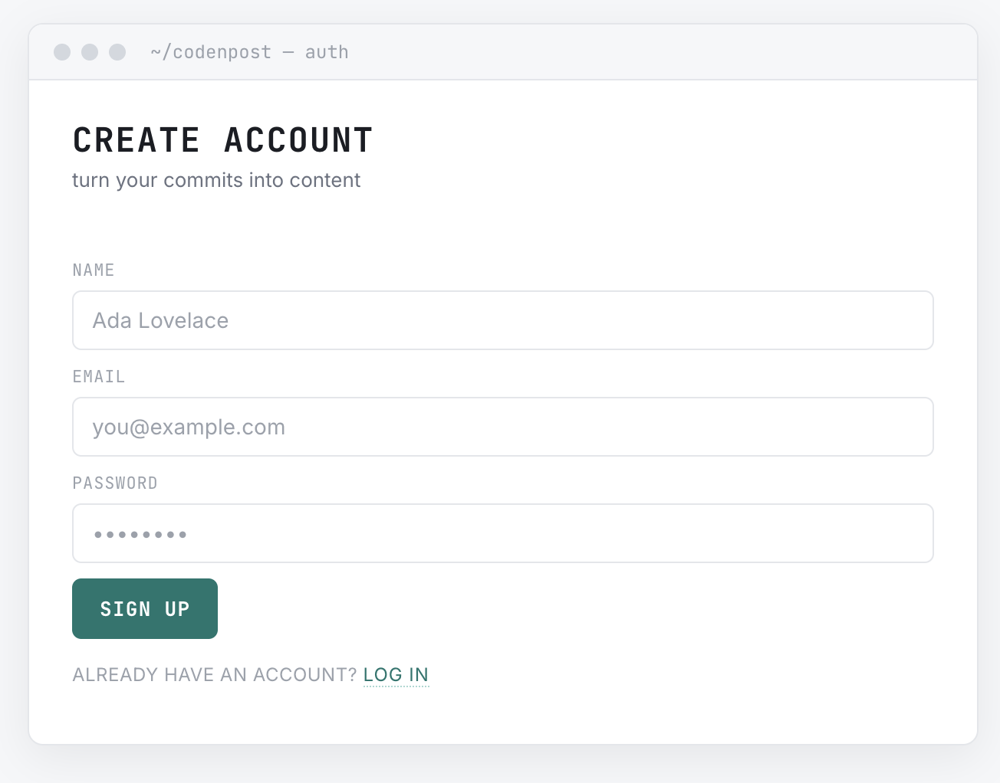

# CodeNPost

Turn your real coding activity into professional LinkedIn content — automatically.

CodeNPost fetches your recent GitHub commits and LeetCode solves, uses AI to turn them into a well-written, accurate LinkedIn post, lets you review and edit it, then publishes it to your real LinkedIn profile with your approval.

**Live demo:** https://code-n-post.vercel.app
**Backend:** https://codenpost-backend.onrender.com

> Note: the backend is hosted on a free tier that spins down after ~15 minutes of inactivity. The first request after idle time may take 30-60 seconds while it wakes back up.

## Screenshots

<table>
<tr>
<td></td>
<td></td>
</tr>
<tr>
<td align="center"><em>Login</em></td>
<td align="center"><em>Dashboard — connect accounts, LinkedIn, generate</em></td>
</tr>
<tr>
<td></td>
<td></td>
</tr>
<tr>
<td align="center"><em>Draft review — edit, regenerate, or publish</em></td>
<td align="center"><em>Signup</em></td>
</tr>
</table>

---

## Why this exists

Developers do real, interesting work every week — commits, solved problems, side projects — and almost never post about any of it, because writing a post takes time and most of that activity feels too small to write up on its own. CodeNPost closes that gap: it does the writing, you do the approving.

## How it works

1. **Connect accounts** — link your GitHub and LeetCode usernames, and connect LinkedIn via OAuth (your LinkedIn password never touches this app)
2. **Generate** — the app fetches your real recent activity and sends it to an AI model, which writes a draft post
3. **Review** — edit the draft directly, or type an instruction like *"make it more casual"* and regenerate
4. **Publish** — one click, and it posts to your real LinkedIn profile

Nothing ever auto-publishes without your click — every post is human-approved before it goes out publicly.

## Architecture

The backend is structured as two decoupled pieces:

- **Data Aggregator** (`githubService.js`, `leetcodeService.js`) — fetches and normalizes raw activity data. Knows nothing about AI or LinkedIn.
- **LLM Copywriter** (`aiService.js`) — takes normalized data, builds a prompt, returns generated text. Knows nothing about where the data came from.

`routes/posts.js` orchestrates both. This separation means swapping the AI provider only ever touches one file.

```
User clicks "Generate"
  → GitHub + LeetCode fetched independently (parallel-safe)
  → Both datasets passed into a balanced, guardrail-constrained AI prompt
  → Draft saved to MongoDB
  → User reviews/edits/regenerates
  → User clicks "Publish" → LinkedIn OAuth token used to post live
```

## Tech stack

**Backend:** Node.js, Express.js, MongoDB + Mongoose, JWT + bcrypt for auth, node-cron for scheduling
**Frontend:** Plain HTML/CSS/JavaScript — no framework, direct `fetch()` calls
**AI:** Groq (OpenAI-SDK-compatible, currently) — architecture supports Gemini as a drop-in swap
**Integrations:** GitHub REST API, LeetCode's GraphQL endpoint, LinkedIn OAuth 2.0 + UGC Posts API
**Deployment:** Vercel (frontend), Render (backend), MongoDB Atlas (database)

## Features

- Full auth system (signup/login, JWT, bcrypt-hashed passwords)
- Real-time GitHub/LeetCode username validation on save
- AI-generated posts balanced across both data sources, with guardrails against unsupported claims (e.g. won't claim a performance "improvement" the data doesn't support)
- Regenerate with custom instructions, without re-fetching source data
- Real LinkedIn OAuth connect + publish
- Automatic daily draft generation via cron for opted-in users (drafts only — never auto-publishes)
- Clear, specific error messages instead of silent failures throughout

## Known limitations

- **LeetCode has no official public API.** This project uses the same unofficial GraphQL endpoint LeetCode's own frontend calls. It works, but could break if LeetCode changes their schema without notice.
- **Free-tier hosting.** Cold starts on the backend, and rate limits on external APIs (GitHub, the AI provider) would need addressing before this could handle significant real traffic.
- **Cron job processes users sequentially**, not in parallel — fine at current scale, would need a proper job queue (BullMQ + Redis) to scale meaningfully.

## Running locally

```bash
# Backend
cd backend
npm install
cp .env.example .env   # fill in your own values
npm run dev

# Frontend
cd frontend
npx serve .             # or use VS Code's Live Server extension
```

See `.env.example` for all required environment variables (MongoDB URI, JWT secret, GitHub token, AI provider key, LinkedIn OAuth credentials).

## Project structure

```
codenpost/
├── backend/
│   ├── config/          # MongoDB connection
│   ├── models/          # User, Post schemas
│   ├── routes/          # auth, accounts, linkedin, posts
│   ├── services/        # github, leetcode, ai, linkedin
│   ├── middleware/       # JWT auth
│   └── cron/             # daily draft scheduler
└── frontend/
    ├── index.html         # login/signup
    ├── dashboard.html      # main app
    ├── css/
    └── js/
```